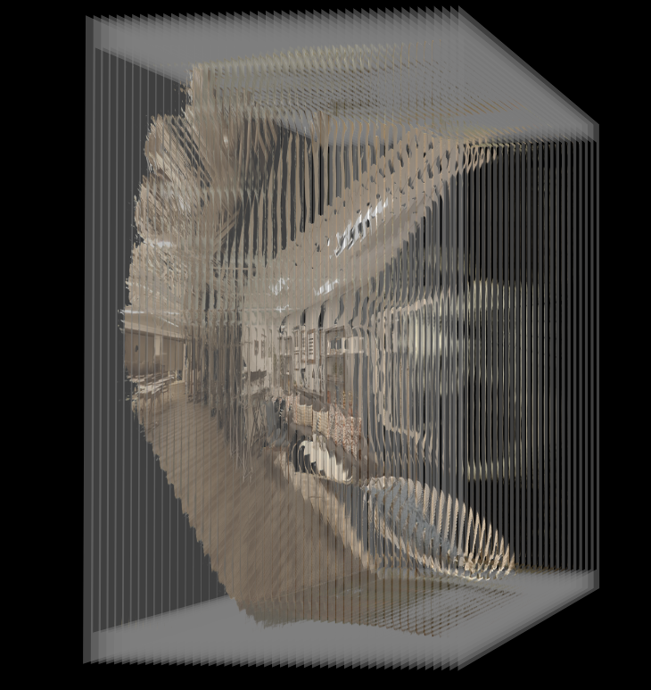
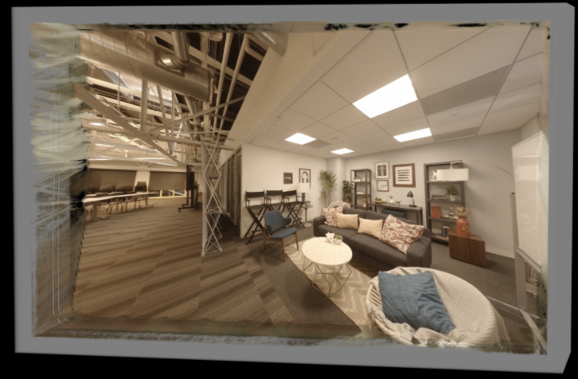

# AE DeepViewer - V1 2019-06-30

A simple "DeepView" layered media viewer example made in AE CC 2018 using the native AE 3D system with transparent depth layers offset on the Z-axis.

There are 47 transparent layers of RGBA images loaded in the AE based 3D comp. Each plane is set back 10 units on the Z-axis from the previous image.

To explore the 3D scene in After Effects, open the "AE DeepView Project.aep" file in After Effects CC2018 or CC2019. Load the "DeepViewLayers" AE pre-comp. Then switch to the Camera tool using the "C" hotkey, and explore the scene using the "MasterCam" camera view.

## Credits

The source footage was downloaded from the [DeepView View Synthesis with Learned Gradient Descent](https://augmentedperception.github.io/deepview/) GitHub repository.

The "AE DeepView Project.aep" file was prepared by [Andrew Hazelden](mailto:andrew@andrewhazelden.com). The AEP file is licensed under GPL v3.

## DeepView Resources:

[https://augmentedperception.github.io/deepview/](https://augmentedperception.github.io/deepview/)

[https://github.com/augmentedperception/deepview](https://github.com/augmentedperception/deepview)

## Screenshots

If you use the AE camera tool to swivel the view at an angle you can see the stack of layers that are used to create the DeepView depth experience.

The AE camera tool allows you to explore the DeepView scene with parallax and depth. You can also look at the "Stereo3D" pre-comp wearing anaglyph 3D glasses.
